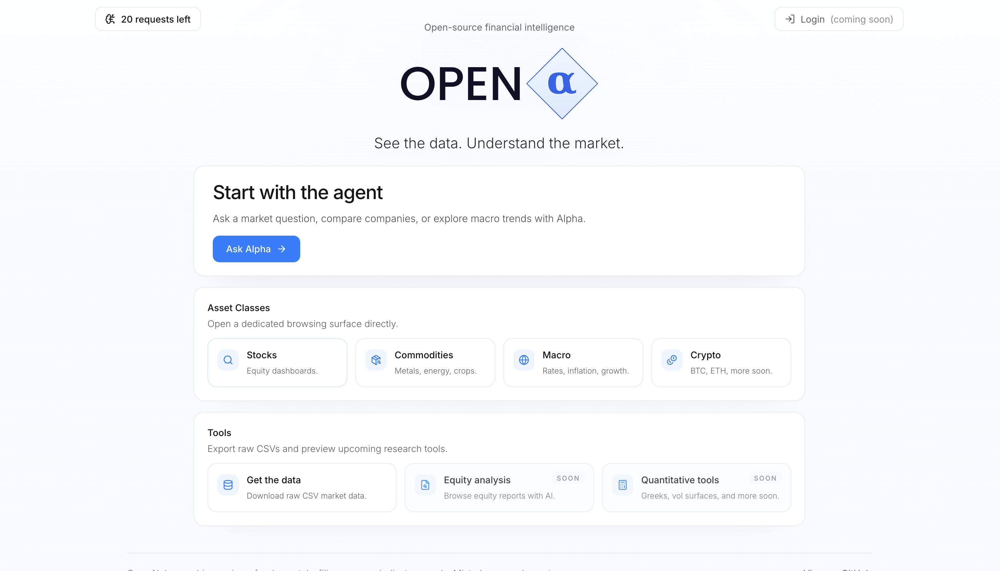
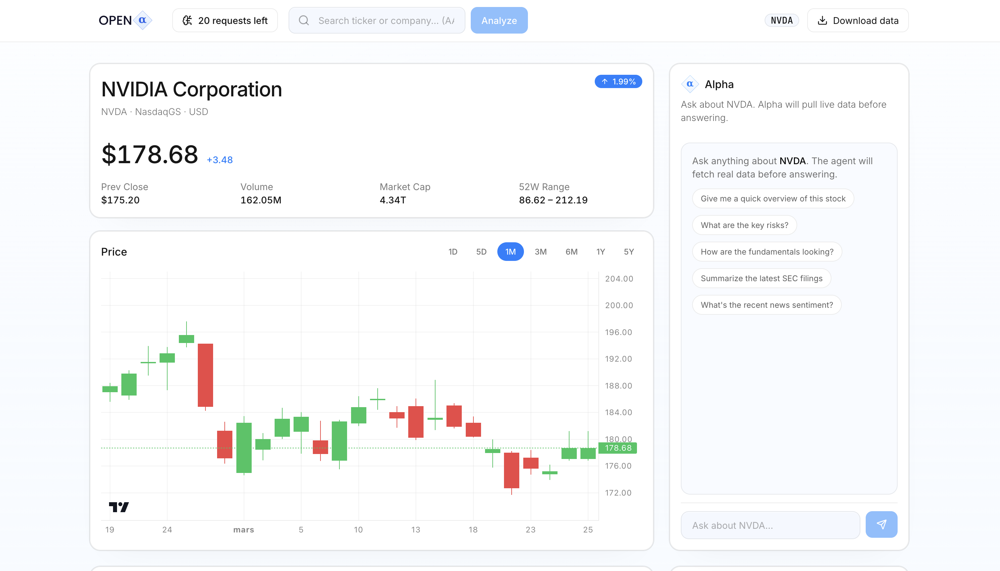
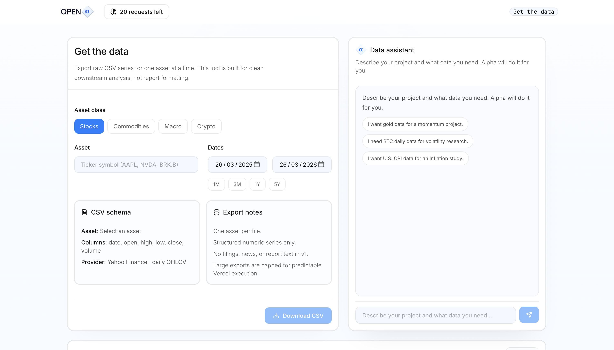
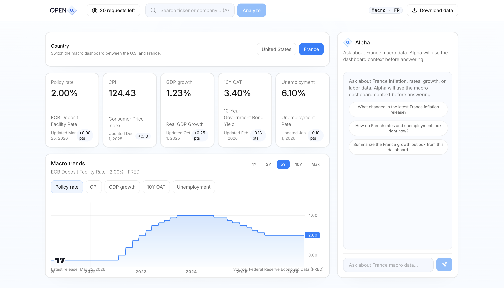

<p align="center">
  
</p>

<h1 align="center">OpenAlpha</h1>

<p align="center">
  <strong>Open-source financial intelligence</strong><br/>
  Live dashboards, CSV data export, and an AI agent grounded in market data.
</p>

<p align="center">
  🔗 <strong>Live demo</strong>: <a href="https://open-alpha-finance.vercel.app">open-alpha-finance.vercel.app</a>
</p>

> Active architecture: **frontend-only Next.js runtime**.
> `backend/` is kept in the repository as legacy/reference code.

## Quick start

OpenAlpha runs from the `frontend/` app only. The Python `backend/` folder is legacy/reference code and is **not** required for local development.

```bash
cd frontend
cp .env.example .env.local
npm install
npm run dev
```

Open `http://localhost:3000`.

Before using the full product, edit `frontend/.env.local` and add the server-side values you need. Start from [frontend/.env.example](./frontend/.env.example).

## Table of contents

- [Quick start](#quick-start)
- [What OpenAlpha does](#what-openalpha-does)
- [Agentic workflow](#agentic-workflow)
- [Product surfaces](#product-surfaces)
- [Architecture](#architecture)
- [Local setup](#local-setup)
- [Deployment](#deployment)
- [Repo layout](#repo-layout)
- [Development checks](#development-checks)
- [Notes for contributors](#notes-for-contributors)


<p align="center"><em>Landing page with agent entry point, asset classes, and tools.</em></p>

## What OpenAlpha does

OpenAlpha provides you a fully configured agent. You can with its help or not:

- Browse stock dashboards with price, fundamentals, news, SEC filings
- Browse curated commodity dashboards across metals, energy, agriculture, and benchmark series
- Explore macro dashboards for the United States and France
- Browse crypto dashboards for BTC and ETH perpetuals
- Export raw CSV time series from the dedicated **Get the data** workspace
- Use an AI agent that stays grounded in the current dashboard or data workflow

### At a glance

| Area           | What you get                                                                |
| -------------- | --------------------------------------------------------------------------- |
| Stocks         | Price, chart, fundamentals, news, filings copilot                       |
| Macro          | U.S. and France dashboards with country-aware context                       |
| Commodities    | Curated dashboards across metals, energy, agriculture, and benchmark series |
| Crypto         | BTC and ETH perpetual dashboards backed by Deribit                          |
| Data retrieval | Raw CSV export with a dedicated planning assistant                          |


<p align="center"><em>Stock dashboard with live market context and grounded agent workflow.</em></p>

## Agentic workflow

OpenAlpha uses a **tool-based agentic workflow**.

The agent stack is intentionally simple and explicit:

- **LLM provider**: Mistral Chat Completions API
- **Model access**: direct server-side `fetch`
- **Runtime**: custom Next.js route handler at `frontend/src/app/api/agent/route.ts`
- **Orchestrator**: custom multi-round tool loop in `frontend/src/server/agent/service.ts`
- **Tool registry**: allowlisted function definitions in `frontend/src/server/agent/tools.ts`
- **Client transport**: Server-Sent Events (SSE)
- **Client rendering**: `react-markdown`, `remark-gfm`, `remark-math`, `rehype-highlight`, `rehype-katex`

When you ask Alpha a question, the model does not answer from memory first. The server builds a context-aware request, lets Mistral decide which allowlisted tools to call, executes those tools server-side, feeds the tool output back into the conversation, and only then streams the final answer to the UI.

### How it works

1. The user sends a prompt from a dashboard or from the **Get the data** workspace.
2. `POST /api/agent` validates the request, applies the request quota, and normalizes the available context:
   - stock ticker
   - macro country
   - commodity instrument
   - crypto instrument
   - data-planning mode
3. The server builds a context-aware user message in `buildUserContent(...)`.
   - Example: on a commodity page, the prompt is augmented so the model knows it must stay grounded in that exact commodity dashboard.
4. The server sends the conversation to Mistral with:
   - the system prompt
   - the user message
   - the allowlisted tool schema from `TOOL_DEFINITIONS`
   - `tool_choice: "auto"`
   - `parallel_tool_calls: false`
5. If the model tries to answer without calling a tool first, OpenAlpha forces another round with:
   - `You must call at least one tool before answering. Do not answer from memory.`
6. Each tool call is executed server-side by `dispatchToolWithDisplay(...)`.
   - Market and research tools return structured JSON back to the model
   - Some tools also emit UI display events such as metric cards or mini charts
7. Tool outputs are appended back into the conversation as `tool` messages, and the loop continues.
   - The loop is bounded to **10 rounds max**
8. When the model is ready to answer, OpenAlpha switches to a streaming completion request and sends SSE events to the browser.
9. The client parses those events and renders:
   - tool call traces
   - tool success/failure states
   - streamed markdown text
   - metric cards
   - inline charts
   - dashboard or data-export handoff cards

### Techniques used

- **Function calling / tool use** through Mistral’s tool schema
- **Context injection** from the active page so the model stays grounded in the right asset or country
- **Bounded planning loop** with explicit maximum tool rounds
- **Structured tool serialization**: tool outputs are returned to the model as JSON, not prose
- **SSE streaming** for low-latency UI updates while the answer is being generated
- **Display side-channel**: tools can emit UI artifacts such as `display_metric`, `display_chart`, and `display_download`
- **Hard allowlist**: only declared server-side tools are callable
- **Quota gating** on agent requests before model execution

### Libraries and implementation choices

OpenAlpha deliberately avoids a heavyweight agent framework. The current stack is:

- **Next.js App Router** for the API runtime
- **Mistral Chat Completions API** for model inference
- **native `fetch`** for model calls and provider calls
- **custom orchestration code** in:
  - `frontend/src/server/agent/service.ts`
  - `frontend/src/server/agent/tools.ts`
  - `frontend/src/server/agent/prompt.ts`
- **`react-markdown`** + **`remark-gfm`** for assistant response rendering
- **`remark-math`** + **`rehype-katex`** for math support
- **`rehype-highlight`** for code block highlighting

Current context-aware behavior:

- **Stock dashboard**: Alpha uses stock, fundamentals, news, filings, and price-history tools for the current ticker
- **Macro dashboard**: Alpha uses macro snapshot and series tools for the selected country
- **Commodity dashboard**: Alpha uses commodity overview and price-history tools for the current instrument
- **Crypto dashboard**: Alpha uses Deribit-backed crypto overview and price-history tools for the current perpetual
- **Get the data**: Alpha acts as a data assistant and maps one project to one supported export at a time

The agent can also suggest handoffs:

- open a stock, macro, commodity, or crypto dashboard when the destination is clear
- open the **Get the data** page with a prefilled export plan when the user asks for raw data


<p align="center"><em>The data workspace for CSV export and project-to-dataset planning.</em></p>

## Product surfaces

### Dashboards

- **Stocks**: equities with overview metrics, chart, fundamentals, news, filings, and agent
- **Macro**: U.S. and France dashboards with country-aware context
- **Commodities**: curated commodity dashboards with charts and agent support
- **Crypto**: BTC and ETH perpetual dashboards backed by Deribit public market data

### Project status

- **Active runtime**: Next.js single-deploy application in `frontend/`
- **Legacy/reference code**: FastAPI backend in `backend/`
- **Deployment target**: Vercel
- **Current crypto scope**: BTC and ETH perpetuals only

### Data retrieval

- **Get the data** exports raw CSV series for:
  - stocks
  - macro
  - commodities
  - crypto
- one asset per export
- CSV only
- raw numeric series only

### AI request quota

- the app includes a configurable AI request quota flow
- when the quota is exhausted, a password unlock modal can add more requests
- production quota enforcement is designed to run server-side with Upstash Redis
- `QUOTA_ENABLED=false` forces the legacy cookie quota path for that deployment


<p align="center"><em>Macro dashboard with country-aware context and live series exploration.</em></p>

## Architecture

### Active runtime

The active application lives in `frontend/`:

- **Next.js App Router**
- server-side route handlers under `frontend/src/app/api/...`
- provider integrations and business logic under `frontend/src/server/...`
- intended for a single deployment on Vercel
- same-origin `/api/...` calls from the UI

### Legacy backend

The Python backend in `backend/` is **legacy/reference code**.

It stays in the repository for migration history and reference value, but the current project direction is to run OpenAlpha as a **frontend-only Next.js application** with server-side route handlers. Contributors should treat the backend as legacy unless they are explicitly working on historical parity or migration context.

## Local setup

### Prerequisites

- Node.js 20+
- npm

Use the **Quick start** section above to install and run the active app locally.

### Configure environment variables

Create `frontend/.env.local` from `frontend/.env.example` and set the server-side values you need.

Required or commonly used variables:


| Variable                       | Purpose                                                                  |
| ------------------------------ | ------------------------------------------------------------------------ |
| `MISTRAL_API_KEY`              | Enables the AI agent                                                     |
| `MISTRAL_MODEL`                | Selects the Mistral model, defaults to `mistral-small-latest` if omitted |
| `FRED_API_KEY`                 | Enables macro data                                                       |
| `EDGAR_USER_AGENT`             | Required for SEC EDGAR access                                            |
| `REQUEST_QUOTA_SIGNING_SECRET` | Signs the request quota cookie                                           |
| `REQUEST_OVERRIDE_PASSWORD`    | Password used to unlock more AI requests                                 |
| `QUOTA_ENABLED`                | Enables the server-side quota adapter, defaults to `true`                |
| `UPSTASH_REDIS_REST_URL`       | Upstash Redis REST endpoint for server-side quota                        |
| `UPSTASH_REDIS_REST_TOKEN`     | Upstash Redis REST token for server-side quota                           |


Important notes:

- secrets are **server-side only**
- do **not** use `NEXT_PUBLIC_` for these values
- the active app does **not** require `NEXT_PUBLIC_API_URL`
- for deployment, these values belong in Vercel environment variables
- if `QUOTA_ENABLED=true`, configure Upstash
- set `QUOTA_ENABLED=false` only when you intentionally want to use the legacy cookie quota path

## Deployment

OpenAlpha is intended to deploy as a single Next.js app on Vercel.

Recommended production setup:

- root directory: `frontend`
- framework preset: `Next.js`
- secrets stored in Vercel environment variables
- same-origin `/api/...` calls only

The active production model is:

- browser UI in Next.js
- server-side route handlers in Next.js
- no separate FastAPI service required

## Repo layout

- `frontend/` — active Next.js application
- `backend/` — legacy FastAPI implementation kept for reference
- `docs/` — plans, rollout notes, and internal documentation

## Development checks

```bash
cd frontend
npm run lint
npm run build
```

## Next implementations

These are the two next product surfaces planned for OpenAlpha after the current dashboards and data workflow.

### Equity analysis

This upcoming surface is intended to focus on **equity reports and AI-assisted document analysis**:

- browse company reports and filings in a dedicated research workspace
- ask grounded questions about business quality, risks, guidance, and operating changes
- use AI to extract the important signal from long-form company materials faster
- stay focused on document-based research assistance rather than full valuation tooling

### Quantitative tools

This upcoming surface is intended to focus on **options analytics and volatility workflows**:

- compute core option Greeks
- explore implied volatility and volatility surfaces
- evaluate payoff and scenario behavior for options positions
- provide practical derivatives analysis tools without turning into a full quant research lab

These are planned next implementations, not active product surfaces in the current runtime yet.

## Notes for contributors

- the root README documents the **active** app, not the historical two-service setup
- if you see Python/FastAPI code in the repo, treat it as legacy unless the task explicitly targets it
- README screenshots live in `README.assets/`
